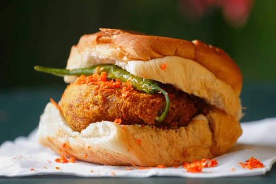
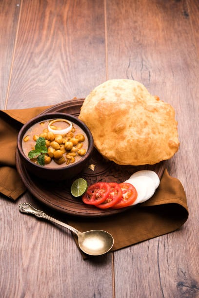
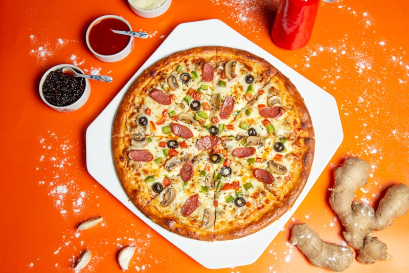
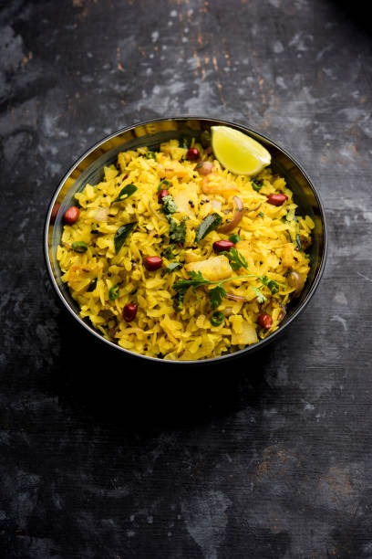
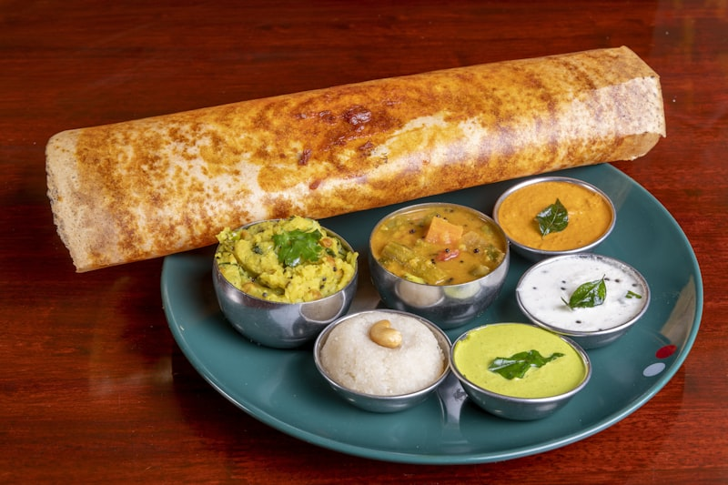
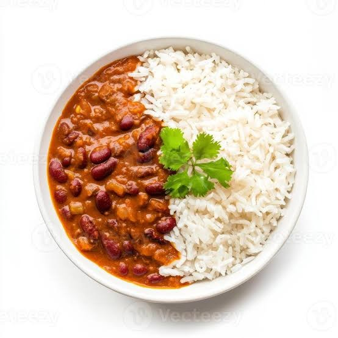
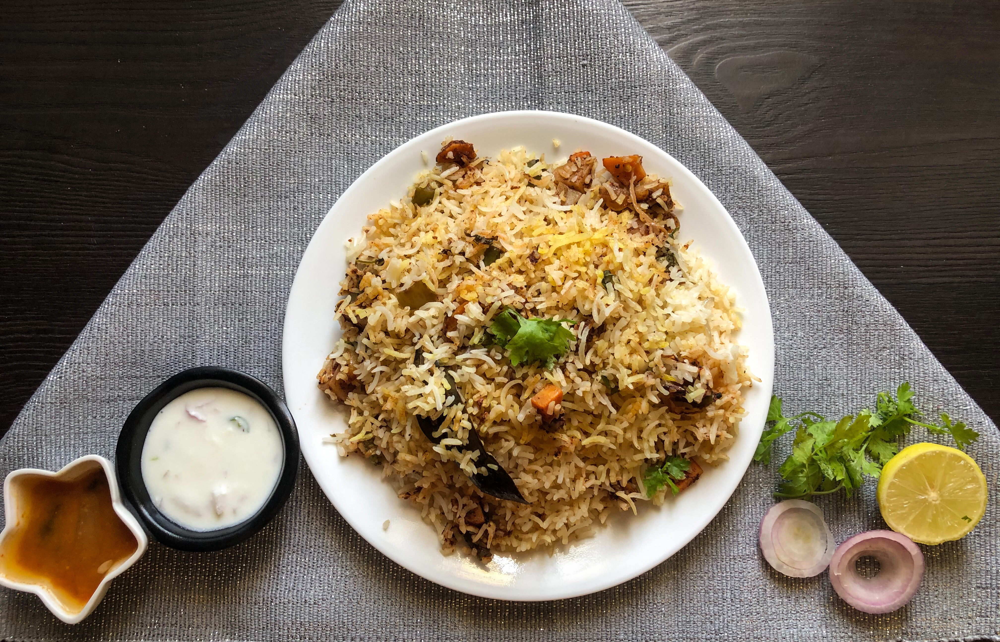
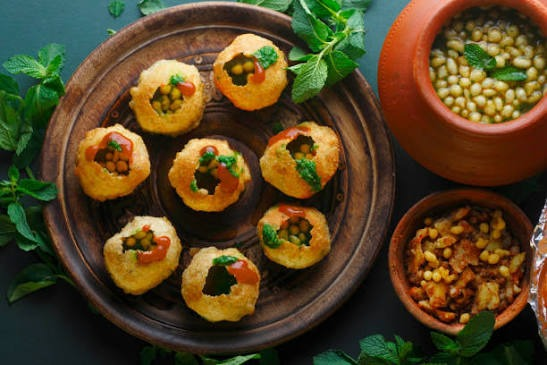
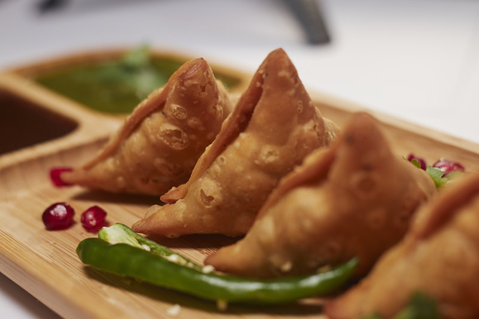

# 🍽️ NutriSnap AI — AI Food & Nutrition Analyzer

> **"Snap Your Food. Understand Your Nutrition."**

Welcome to **NutriSnap AI**, a full-stack, AI-powered food recognition, nutrition analysis, and health coaching platform fine-tuned for Indian regional street foods and global cuisine worldwide.

🌐 **Live Application URL**: [https://nutrisnap-ai-web.onrender.com](https://nutrisnap-ai-web.onrender.com)  
👨‍💻 **Developer**: **Yash Rajbhar** ([yashrajbhar316@gmail.com](mailto:yashrajbhar316@gmail.com))  
🐙 **GitHub Repository**: [https://github.com/YASH-RAJBHAR/food-analyzer-project](https://github.com/YASH-RAJBHAR/food-analyzer-project)

---

## 🌟 Key Features Overview

| Feature Tab | Description | Visual Preview |
| :--- | :--- | :---: |
| **🏠 Home & Scan** | AI Vision Scanner, Live Camera Viewfinder & Dish Recognition |  |
| **🇮🇳 Indian Special** | Fine-tuned AI model for Indian street food (Vada Pav, Pav Bhaji, Dosa, Biryani, Chole Bhature, Samosa) |  |
| **🌐 World Food** | Global regional dish identification (Pizza, Cheeseburger, Fresh Sushi) |  |
| **📓 Food Diary** | Daily calorie budget progress bar (2000 kcal), meal logging & history table |  |
| **🥗 14-Diet Matrix** | Evaluates 14 dietary rules in real-time (Vegan, Keto, Low Carb, Diabetic, Gluten-Free, Halal, Kosher) |  |
| **📷 Barcode / OCR** | Live UPC/EAN OpenFoodFacts barcode lookup + ingredient label OCR scanner |  |
| **🎯 Goals & Water** | Interactive hydration log (`+250ml`), target calorie calculator & macro sliders |  |
| **🤖 AI Coach** | Chat with Chef Bot powered by Gemini 1.5 Flash + typo-tolerant knowledge engine |  |
| **📈 Analytics** | Upload history trends, macro pie chart breakdown & average health score |  |

---

## 📸 Website UI & Features Showcase

<!-- ==============================================================================
     SCREENSHOT INSTRUCTIONS:
     Save your screenshots inside: frontend/public/images/ui/ using these exact names:
     - 01_hero_scanner.png
     - 02_analysis_report.png
     - 03_indian_showcase.png
     - 04_diet_matrix.png
     - 05_food_diary.png
     - 06_barcode_ocr.png
     - 07_ai_coach.png
     - 08_analytics.png
     ============================================================================== -->

### 1. Main Home & AI Vision Scanner
*Top navbar with NutriSnap AI logo, orange hero banner ("What's on your plate?") and central image upload scanner card.*


---

### 2. AI Dish Identification & Health Score Report
*Analysis report showing recognized dish name, AI precision %, health score (0-100), macronutrient breakdown & verified dish photo.*


---

### 3. Indian Regional Special Showcase
*Fine-tuned Indian street food showcase grid (Vada Pav, Pav Bhaji, Masala Dosa, Biryani, Chole Bhature, Samosa).*


---

### 4. 14-Diet Compatibility Matrix
*Real-time dietary rule matrix evaluation with interactive food selector bar (Vegan, Keto, Low Carb, Diabetic Friendly, Gluten Free, Halal).*


---

### 5. Food Diary & Daily Calorie Budget
*Daily 2000 kcal progress bar, meal breakdown cards (Breakfast, Lunch, Snacks, Dinner) and meal history log.*


---

### 6. Barcode & Ingredient Label OCR Scanner
*Live UPC/EAN OpenFoodFacts barcode product lookup and packaged food ingredient label OCR scanner.*


---

### 7. Smart AI Nutrition Coach
*Interactive nutrition chat assistant powered by Gemini 1.5 Flash + typo-tolerant AI knowledge engine.*


---

### 8. Analytics & Nutrition Trends
*Upload history statistics, macro pie chart breakdown, average health score, and searchable history log table.*


---

## 🏗️ System Architecture & Data Flow

```
                               ┌─────────────────────────┐
                               │     User Web Browser    │
                               └────────────┬────────────┘
                                            │
                                            ▼
                               ┌─────────────────────────┐
                               │   React 18 SaaS App     │
                               │ (nutrisnap-ai-web)      │
                               └────────────┬────────────┘
                                            │
                           HTTP Requests (REACT_APP_BACKEND_URL)
                                            │
                                            ▼
                               ┌─────────────────────────┐
                               │   Spring Boot 3 Backend │
                               │ (food-analyzer-backend) │
                               └────────────┬────────────┘
                                            │
                          HTTP API Requests (FLASK_AI_URL)
                                            │
                                            ▼
                               ┌─────────────────────────┐
                               │    Python AI Service    │
                               │ (food-analyzer-ai)      │
                               └────────────┬────────────┘
                                            │
                       ┌────────────────────┴────────────────────┐
                       │                                         │
                       ▼                                         ▼
         ┌───────────────────────────┐             ┌───────────────────────────┐
         │   Gemini 1.5 Vision API   │             │   HuggingFace CLIP /      │
         │   & AI Coach Agent API    │             │  Feature Match Engine     │
         └───────────────────────────┘             └───────────────────────────┘
```

---

## 🚀 Easy Local Setup (Run in 3 Steps)

### Step 1: Start Python AI Service
```powershell
cd ai-service
python -m venv venv
.\venv\Scripts\Activate.ps1
pip install -r requirements.txt
python app.py
```
*AI Service runs locally on `http://127.0.0.1:5001`*

### Step 2: Start Java Spring Boot Backend
```powershell
cd backend
mvnw.cmd spring-boot:run
```
*Backend runs locally on `http://localhost:8080`*

### Step 3: Start React Frontend
```powershell
cd frontend
npm install
npm start
```
*Frontend opens automatically on `http://localhost:3000`*

---

## ☁️ Render Cloud Deployment Guide

NutriSnap AI is configured for 1-click cloud hosting on [Render](https://render.com).

### 1. Python AI Web Service (`ai-service`)
- **Root Directory**: `ai-service`
- **Runtime**: `Python 3`
- **Build Command**: `pip install -r requirements.txt`
- **Start Command**: `gunicorn --bind 0.0.0.0:$PORT app:app`
- **Environment Variables**: `PORT=5001`, `GEMINI_API_KEY` *(Optional)*

### 2. Java Spring Boot Web Service (`backend`)
- **Root Directory**: `backend`
- **Runtime**: `Docker`
- **Dockerfile Path**: `Dockerfile`
- **Environment Variables**:
  - `PORT`: `8080`
  - `FLASK_AI_URL`: `https://food-analyzer-ai-service.onrender.com/predict`
  - `CORS_ALLOWED_ORIGINS`: `https://nutrisnap-ai-web.onrender.com`

### 3. React Frontend Static Site (`frontend`)
- **Root Directory**: `frontend`
- **Build Command**: `npm run build`
- **Publish Directory**: `build`
- **Environment Variables**:
  - `NODE_VERSION`: `18.20.0`
  - `REACT_APP_BACKEND_URL`: `https://food-analyzer-backend.onrender.com`

---

## ⚙️ Environment Variables Summary

| Variable Name | Service | Description | Example Value |
| :--- | :--- | :--- | :--- |
| `REACT_APP_BACKEND_URL` | Frontend | Deployed Spring Boot URL | `https://food-analyzer-backend.onrender.com` |
| `FLASK_AI_URL` | Backend | Deployed Python AI prediction endpoint | `https://food-analyzer-ai-service.onrender.com/predict` |
| `CORS_ALLOWED_ORIGINS` | Backend | Allowed origin URL for CORS requests | `https://nutrisnap-ai-web.onrender.com` |
| `PORT` | All | Dynamic listening port | `8080` / `5001` |

---

## 👨‍💻 Author & Contact

**NutriSnap AI** is developed and maintained by **Yash Rajbhar**.

- ✉️ **Email**: [yashrajbhar316@gmail.com](mailto:yashrajbhar316@gmail.com)
- 🐙 **GitHub**: [https://github.com/YASH-RAJBHAR/food-analyzer-project](https://github.com/YASH-RAJBHAR/food-analyzer-project)
- 🌐 **Live Website**: [https://nutrisnap-ai-web.onrender.com](https://nutrisnap-ai-web.onrender.com)

*Built with ❤️ for Foodies & Health Enthusiasts Worldwide! 🎉*
